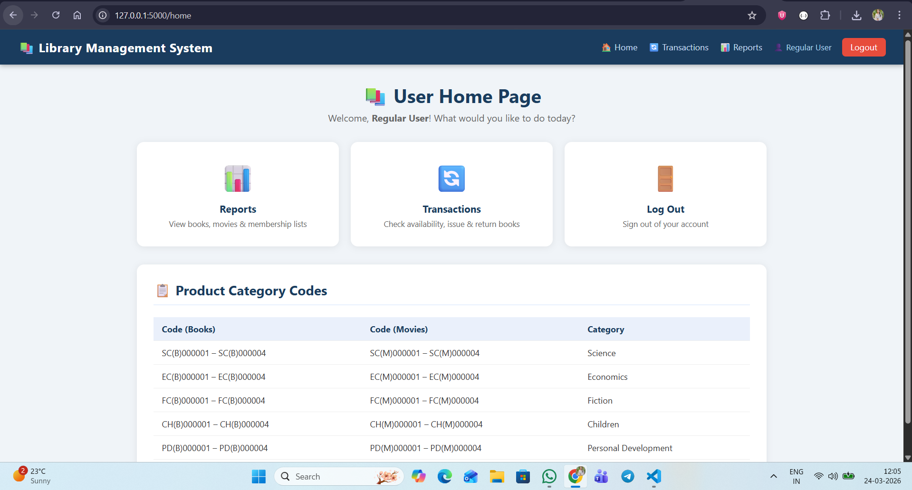
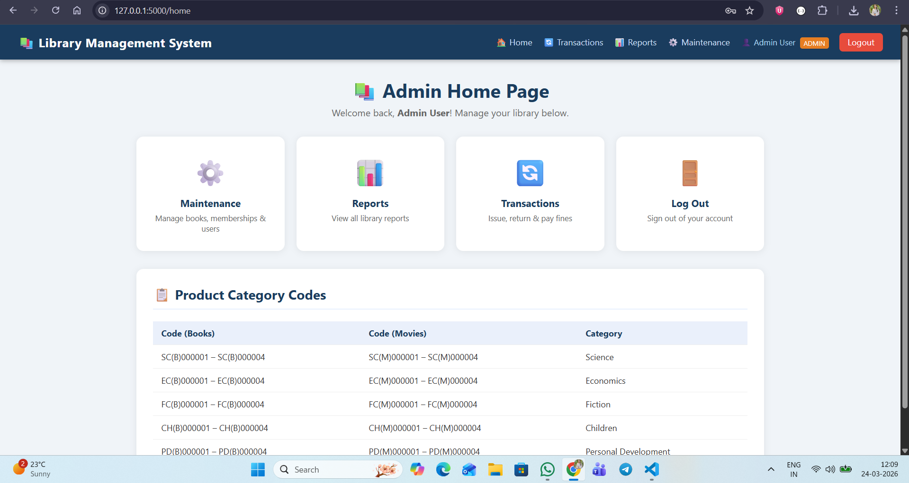
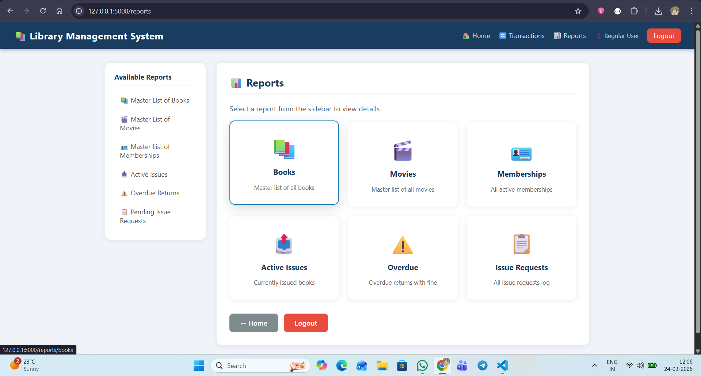
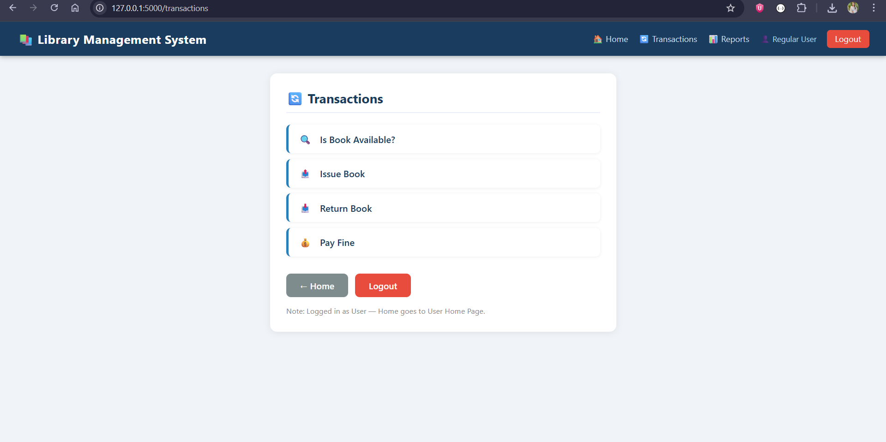
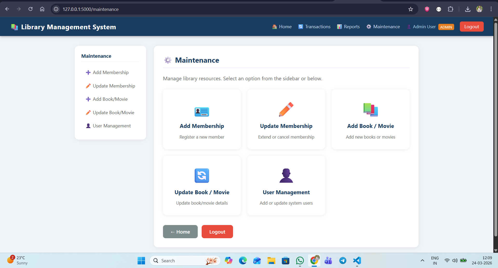

# 📚 Library Management System

A full-featured **Library Management System** built with **Python (Flask)** and **SQLite**. Includes Admin and User login portals, transactions (issue/return/fine), reports, and complete maintenance module.

---

## 🚀 Features

### Authentication
- **Admin Login** (`adm` / `adm`) — full access to Maintenance + Reports + Transactions
- **User Login** (`user` / `user`) — access to Reports + Transactions only
- Passwords hidden on login pages

### Transactions
- ✅ **Book Availability** — search by name or author, view availability
- 📤 **Book Issue** — issue books with auto-populated author, date validation (max 15 days)
- 📥 **Return Book** — return with auto-filled issue info
- 💰 **Pay Fine** — auto-calculated fine (₹5/day overdue), checkbox confirmation

### Reports
- 📚 Master List of Books
- 🎬 Master List of Movies
- 🪪 Master List of Memberships
- 📤 Active Issues
- ⚠️ Overdue Returns (with fine calculation)
- 📋 Issue Requests log

### Maintenance (Admin Only)
- ➕ Add / ✏️ Update Membership (6 months / 1 year / 2 years)
- ➕ Add / ✏️ Update Book or Movie
- 👤 User Management (add / update users, admin toggle)

## 📸 Screenshots

### 🔐 Login Page


### 👨‍💼 Admin Dashboard


### 👤 User Dashboard


### 📤 Book Issue


### 📊 Admin Page


---

## 🛠️ Tech Stack

| Layer    | Technology              |
|----------|-------------------------|
| Backend  | Python 3, Flask         |
| Database | SQLite (via SQLAlchemy) |
| Frontend | HTML5, CSS3 (custom)    |
| ORM      | Flask-SQLAlchemy        |

---

## ⚙️ Installation & Running Locally

### 1. Clone the repository
```bash
git clone https://github.com/YOUR_USERNAME/library-management-system.git
cd library-management-system
```

### 2. Create a virtual environment
```bash
python -m venv venv

# Activate (Windows)
venv\Scripts\activate

# Activate (Mac/Linux)
source venv/bin/activate
```

### 3. Install dependencies
```bash
pip install -r requirements.txt
```

### 4. Run the application
```bash
python app.py
```

### 5. Open in browser
```
http://127.0.0.1:5000
```

---

## 🔐 Default Login Credentials

| Role  | Username | Password |
|-------|----------|----------|
| Admin | `adm`    | `adm`    |
| User  | `user`   | `user`   |

You can add/update users from Admin → Maintenance → User Management.

---

## 📁 Project Structure

```
library_management_system/
├── app.py                  # Main Flask application
├── requirements.txt        # Python dependencies
├── README.md
├── .gitignore
├── static/
│   └── css/
│       └── style.css       # All styles
└── templates/
    ├── base.html           # Base layout with navbar
    ├── login.html
    ├── logout.html
    ├── admin_home.html
    ├── user_home.html
    ├── transactions.html
    ├── book_available.html
    ├── book_issue.html
    ├── return_book.html
    ├── pay_fine.html
    ├── reports.html
    ├── report_books.html
    ├── report_memberships.html
    ├── report_issues.html
    ├── report_overdue.html
    ├── report_issue_requests.html
    ├── maintenance.html
    ├── add_membership.html
    ├── update_membership.html
    ├── add_book.html
    ├── update_book.html
    ├── user_management.html
    ├── confirmation.html
    └── cancel.html
```

---

## 📋 Business Rules Implemented

- Issue date cannot be in the past
- Return date auto-set to 15 days from issue; cannot exceed 15 days
- Fine = ₹5 per overdue day
- Fine must be marked as paid before completing a return (if fine exists)
- Admin can access Maintenance; regular users cannot
- At least one field (name or author) required before searching availability
- All mandatory fields validated before form submission

---

## 📌 Notes / Assumptions

- SQLite database is created automatically on first run (`instance/library.db`)
- Sample data (books, movies, memberships) is seeded on first run
- Serial numbers are auto-generated using category + type prefix (e.g., `SC(B)000001`)
- Membership IDs are auto-generated (e.g., `MEM00001`)
